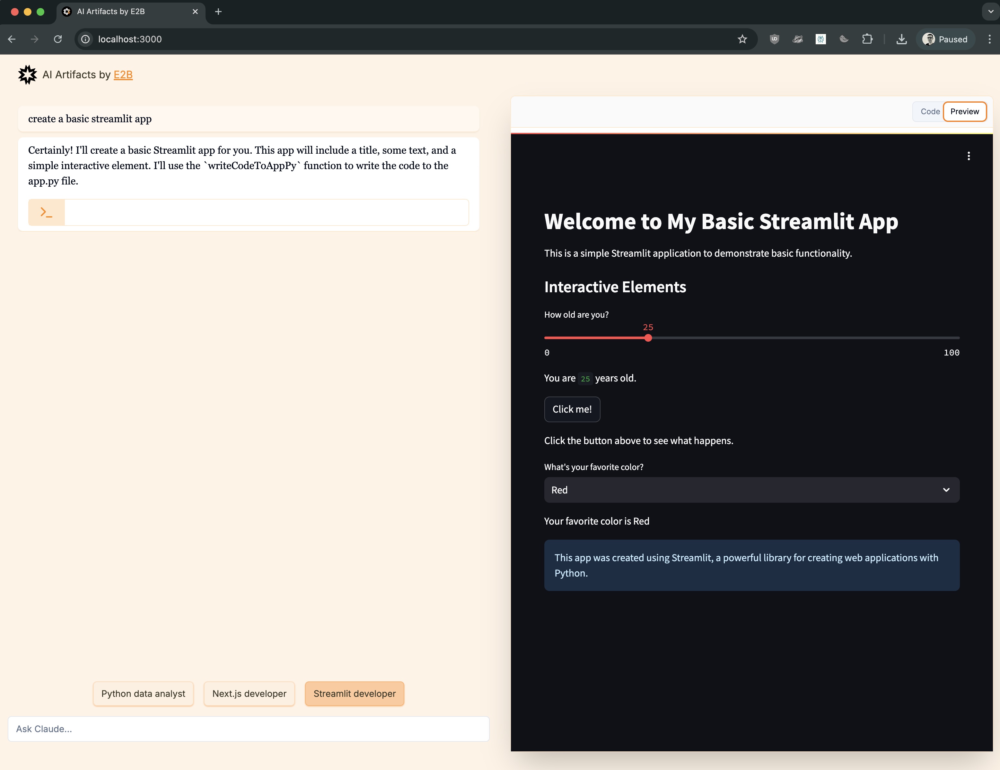

# AI Artifacts - Open Source AI Code Execution Sandbox
This app is an open source version of [Anthropic's Artifacts UI](https://www.anthropic.com/news/claude-3-5-sonnet) in their [Claude chat app](https://claude.ai/).

This app is using [E2B](https://e2b.dev/docs)'s [Code Interpreter SDK](https://github.com/e2b-dev/code-interpreter) and [Core SDK](https://github.com/e2b-dev/e2b) for AI code execution. E2B provides a cloud sandbox to run AI-generated code securely and can handle installing libraries, running shell commands, and running Python, Next.js, and Streamlit apps.




## Features
- **Multiple AI model providers** via [Vercel AI SDK](https://sdk.vercel.ai/docs/introduction):
  - [OpenAI](https://openai.com/): GPT-4o, GPT-4o Mini, GPT-4 Turbo
  - [Anthropic](https://www.anthropic.com/): Claude 3.5 Sonnet
  - [Google AI](https://ai.google.dev/): Gemini 1.5 Pro, Gemini 1.5 Flash
  - [Mistral](https://mistral.ai/): Mistral Large, Mistral Nemo
  - [Groq](https://groq.com/): Llama 3.1 70B, Llama 3 Groq 70B Tool Use
  - [Together AI](https://www.together.ai/): Llama 3.1 70B
  - [Ollama](https://ollama.com/) (local): Llama 3.1, Mistral Nemo, Mistral Large
- [Code Interpreter SDK](https://github.com/e2b-dev/code-interpreter) from [E2B](https://e2b.dev) for secure AI code execution using sandboxes
- Streaming AI responses and tool calls
- Three AI personas (sandbox templates):
  - ✅ **Python data analyst** — runs AI-generated Python in a Jupyter notebook
  - ✅ **Next.js developer** — generates and runs AI-generated Next.js apps
  - ✅ **Streamlit developer** — generates and runs AI-generated Streamlit apps
- Optional [Supabase](https://supabase.com/) authentication
- Configurable model parameters (temperature, top P, top K, frequency/presence penalty, max tokens)

## Setup

### 1. Install dependencies
```sh
npm i
```

### 2. Set API keys
Create a `.env.local` file based on `.env.template` and set the following:
```sh
# Required — get your E2B API key at https://e2b.dev/
E2B_API_KEY="your-e2b-api-key"

# Set the API key for whichever model provider(s) you want to use
ANTHROPIC_API_KEY="your-anthropic-api-key"
OPENAI_API_KEY="your-openai-api-key"
GOOGLE_GENERATIVE_AI_API_KEY="your-google-api-key"
MISTRAL_API_KEY="your-mistral-api-key"
GROQ_API_KEY="your-groq-api-key"
TOGETHER_AI_API_KEY="your-together-ai-api-key"

# Optional — enable Supabase authentication
# NEXT_PUBLIC_ENABLE_SUPABASE=true
# NEXT_PUBLIC_SUPABASE_URL="your-supabase-url"
# NEXT_PUBLIC_SUPABASE_ANON_KEY="your-supabase-anon-key"
```

### 3. Run
```sh
npm run dev
```
